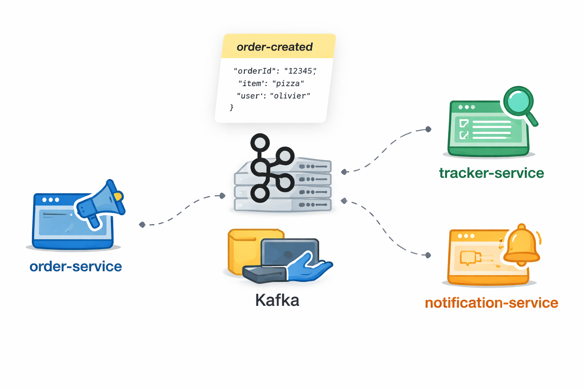

# Event-Driven Order Platform



A small Kafka-based event-driven system that demonstrates how one service publishes order events and another service consumes them asynchronously.

This project is intentionally small, but it is structured to reflect real engineering concerns:

- clear service boundaries
- local developer experience
- Docker-based infrastructure
- event schema documentation
- environment-driven configuration
- separation between producer and consumer responsibilities

---

## Why this project exists

This repository is designed as a portfolio project to demonstrate practical understanding of:

- Apache Kafka fundamentals
- event-driven communication
- producer / consumer responsibilities
- local development with Docker Compose
- topic design and message contracts
- basic software organization for backend systems

It is not intended to be production-ready, but it is intentionally structured to look and feel like a realistic backend engineering exercise rather than a tutorial dump.

---

## Architecture overview

```text
+------------------+         +------------------+         +----------------------+
|   order-service  | ----->  |      Kafka       | ----->  |   tracker-service    |
|   producer.py    |         |   topic: orders  |         |     tracker.py       |
+------------------+         +------------------+         |     notifier.py      |
                                      |                    +----------------------+
                                      |
                                      v
                               +----------------+
                               |   Kafka UI     |
                               | localhost:8080 |
                               +----------------+
```
---
Tech stack
- Python 3.12
- Apache Kafka (KRaft mode)
- Docker Compose
- Kafka UI
- JSON event payloads
---

### Repository structure

```text
event-driven-order-platform/
├── docker-compose.yml
├── Makefile
├── README.md
├── CONTRIBUTING.md
├── LICENSE
├── .env.example
├── .gitignore
│
├── docs/
│   ├── architecture.md
│   ├── security.md
│   └── demo.md
│
├── schemas/
│   └── order-created.json
│
├── topics/
│   └── create-topics.sh
│
├── tests/
│   ├── test_order_schema.py
│   └── test_build_order_event.py
│
└── services/
    ├── order-service/
    │   ├── producer.py
    │   ├── requirements.txt
    │   └── Dockerfile
    │
    ├── tracker-service/
    │   ├── tracker.py
    │   ├── requirements.txt
    │   └── Dockerfile
    │
    └── notification-service/
        ├── notifier.py
        ├── requirements.txt
        └── Dockerfile
```
---
### Local setup

#### 1. Create a virtual environment

```bash
python3 -m venv .venv
source .venv/bin/activate
```

#### 2. Install local Python dependencies

```bash
pip install -r services/order_service/requirements.txt
pip install -r services/tracker_service/requirements.txt
```

#### 3. Start Kafka and Kafka UI

```bash
make up
```

#### 4. Create the topic

```bash
make topics
```

#### 5. Start the consumer

```bash
make consume
```

#### 6. Publish a message

```bash
make produce
```

#### 7. Inspect messages

Open Kafka UI in your browser:

```bash
http://localhost:8080
```
---

### Demo walkthrough

A visual walkthrough of the system running locally — including Kafka UI screenshots — is available here:

```text
docs/demo.md
```

The demo shows:

- Kafka broker running in KRaft mode
- the `orders` topic receiving messages
- multiple consumer groups processing the same event
- message inspection inside Kafka UI

Example screenshots included in the demo:

- Kafka cluster overview
- Orders topic information
- Example message payload

---

### Networking model

This project intentionally uses two broker addresses:
- kafka:9092 for containers running inside Docker Compose
- localhost:29092 for Python scripts running directly on the host machine

This dual-listener configuration avoids common local development issues when mixing Dockerized infrastructure with host-based scripts.

---

### Topic design

Topic: orders

This topic carries order creation events published by the producer.

Example payload:

```json
{
  "orderId": "8e88d6b8-6844-4ed9-b840-d30fb62f5802",
  "orderDate": "2026-03-09T15:35:00.000000+00:00",
  "user": "Olivier",
  "item": "margarita",
  "quantity": 2
}
```

The schema is documented in:

```text
schemas/order-created.json
```

---

### Current services

**order-service**  
Produces `order-created` events to the Kafka `orders` topic.

**tracker-service**  
Consumes `order-created` events for tracking and logging purposes.

**notification-service**  
Consumes the same `order-created` events and simulates sending a user-facing notification.

Together, these services demonstrate a simple fan-out event-driven architecture where one producer publishes an event and multiple consumers react to it independently.

---

### Useful commands

Start infrastructure:

```bash
make up
```
Stop infrastructure:
```bash
make down
```
Reset Kafka state:
```bash
make reset
```
Create topics:
```bash
make topics
```
Run producer:
```bash
make produce
```
Run consumer:
```bash
make consume
```
Follow logs:
```bash
make logs
```

---

### Design notes

This project intentionally keeps the implementation simple, but a few choices are deliberate:
- producer and consumer are split into separate services
- topic creation is automated through a script
- event structure is documented with a JSON schema
- configuration is environment-driven
- Docker files are service-specific instead of using a fake shared placeholder image

---

### Future improvements

Possible next steps:
- add an inventory-service
- add retry and dead-letter topics
- validate outgoing events against the JSON schema
- add structured logging
- add automated tests
- containerize the producer and consumer services in Compose
- add health checks and topic readiness handling

---

### Interview talking points

This repository is intentionally good for discussing:
- why asynchronous messaging is useful
- why Kafka needs different listeners for host vs Docker clients
- producer vs consumer responsibilities
- event schema contracts
- single-broker local tradeoffs
- future production concerns like retries, DLQs, auth, TLS, and idempotency

---

### License

This project is licensed under the MIT License.