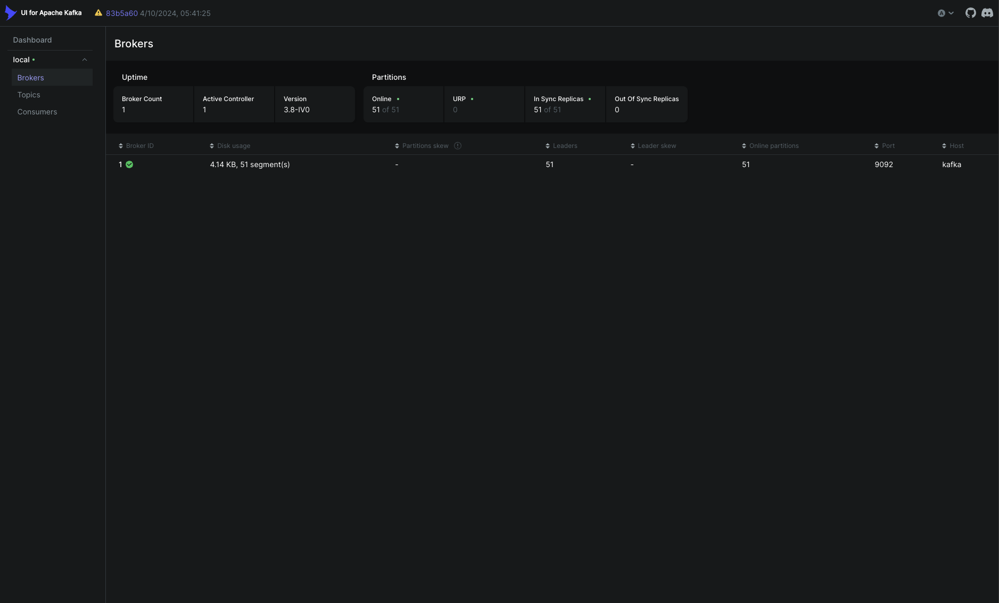
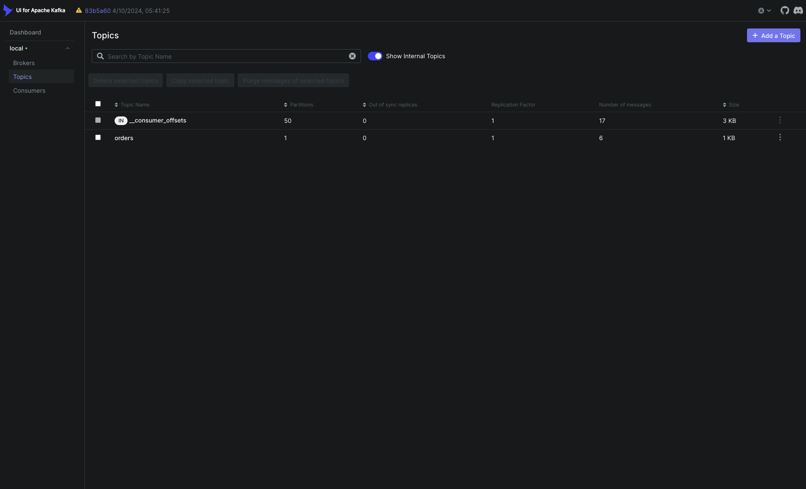
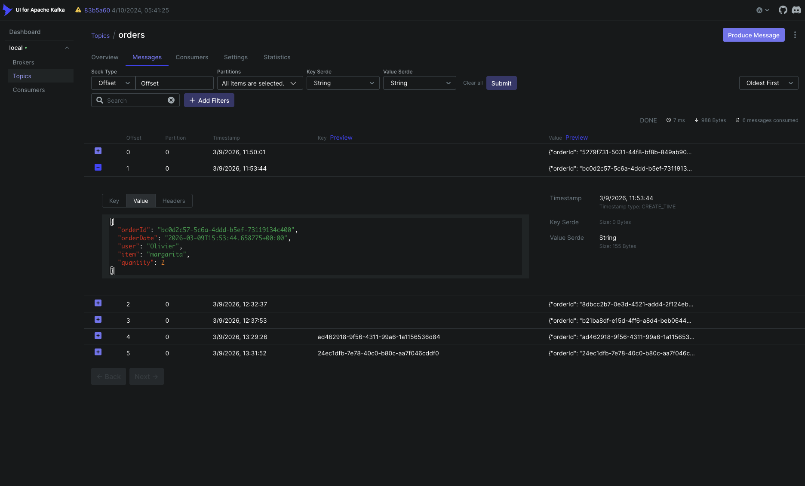

# Demo

This document shows the expected local demo flow for the project.

## Goal

Demonstrate a simple event-driven workflow where:

1. the producer publishes an `orders` event
2. Kafka stores the event in the topic
3. multiple consumers process the same event independently
4. Kafka UI can be used to inspect the topic and messages

---

## Start the infrastructure

```bash
make up
make topics
```
Kafka UI will be available at:
```text
http://localhost:8080
```

---

## Run the consumer services

In one terminal:
```bash
make consume
```
In another terminal, run the notification service manually:
```bash
python services/notification_service/notifier.py
```

---

## Publish an order event

In a separate terminal:
```bash
make produce
```
Expected producer output:
```text
Message delivered successfully
Topic: orders
Partition: 0
Offset: 1
Key: 8e88d6b8-6844-4ed9-b840-d30fb62f5802
Value: {"orderId":"...","orderDate":"...","user":"Olivier","item":"margarita","quantity":2}
```

---

## Expected tracker-service output
```text
Received order event
Order ID: 8e88d6b8-6844-4ed9-b840-d30fb62f5802
User: Olivier
Item: margarita
Quantity: 2
Partition: 0
Offset: 1
------------------------------------------------------------
```

---

## Expected notification-service output

```text
Notification sent
User: Olivier
Message: Your order for 2 x margarita has been received.
------------------------------------------------------------
```

---

## Kafka UI

### Cluster overview



### Orders topic



### Orders message



---

